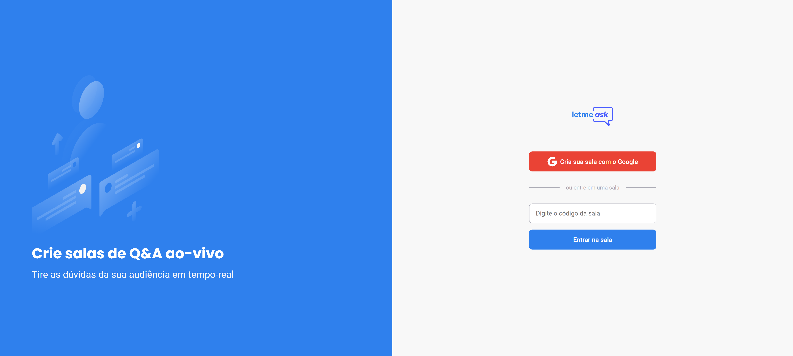
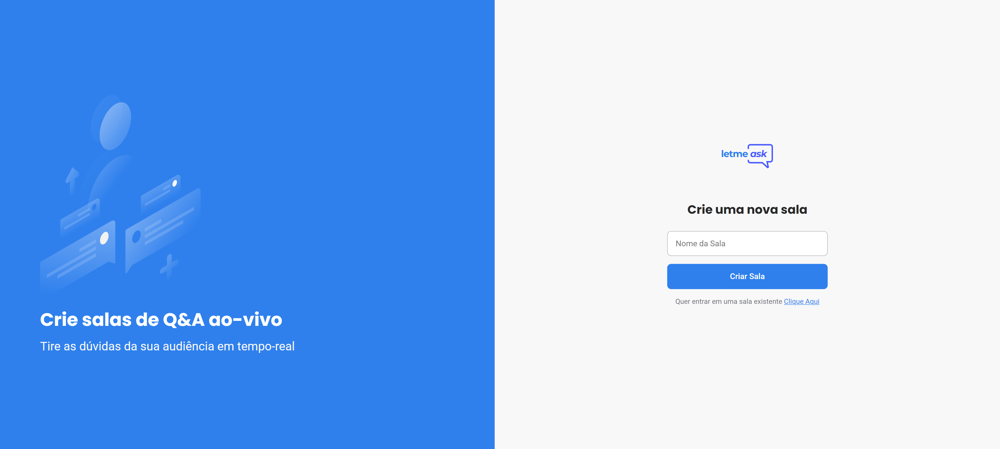
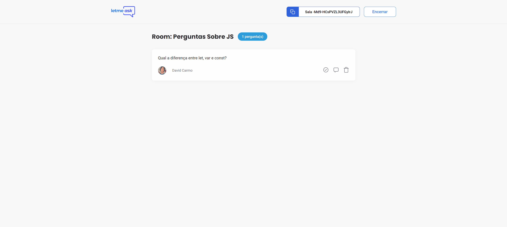
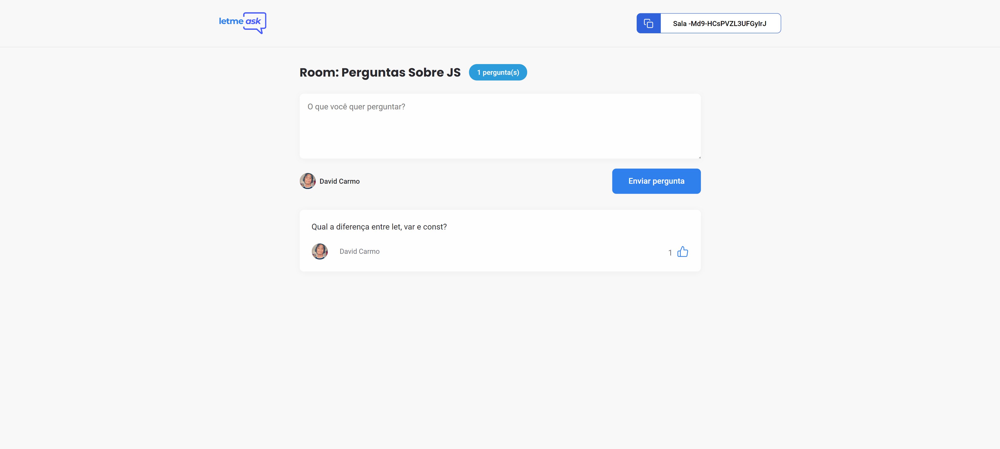
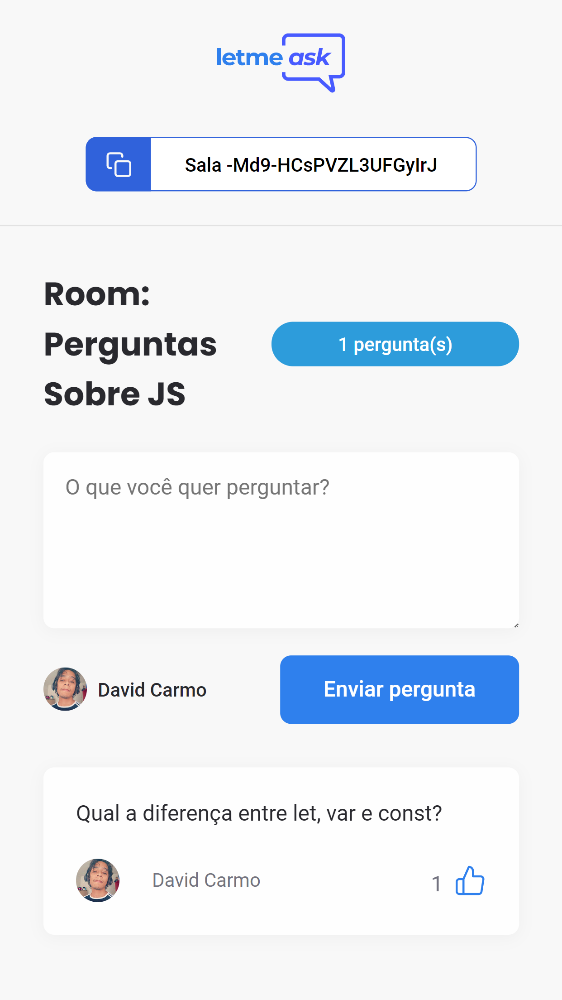

# NLW TOGETHER - LETMEASK

Aplicação desenvolvidade durante a semana NLW Together (20 a 27 de junho de 2021);

<p align="center">
   
</p>

# 💻 Sobre a aplicação
A LetMeAsk é uma aplicação web que faz a criação de salas para perguntas e apresenta a visão dessas salas do ponto de vista do admin e do usuário. As perguntas criadas são armazenadas no firebase e para a criação das perguntas é necessário realizar uma autenticação com o google.  

# 🚀 Tecnologias Utilizadas
+ <a href="https://reactjs.org/" target="_blank">  ReactJS </a> 

+ <a href="https://sass-lang.com/" target="_blank">  SASS</a>

+ <a href="https://firebase.google.com/" target="_blank">  Firebase</a>

# 🎨 Layout

O layout original pode ser acessado <a src="https://www.figma.com/file/D8S1RwNcYFtRz1OPkytB3e/Letmeask-(Copy)?node-id=0%3A1" target="_blank"> aqui.</a>
## Home - WEB

 

## Criação de Sala - WEB


## Sala Visão do Admin - WEB


## Sala Visão do User - WEB



## Home - Responsivo

 

## Criação de Sala - Responsivo


## Sala Visão do Admin - Responsivo


## Sala Visão do User - Responsivo



# ⚙️ Pré - Requisitos e Execução

Antes de começar, você vai precisar ter instalado em sua máquina as seguintes ferramentas:
Git, NPM e o VSCode.
<p>Siga os passos a seguir: </p>  

+ Instale as dependências com npm install 
+ Cria o arquivo .env.local e crie as seguintes variáveis ambiente: 
```env
REACT_APP_API_KEY = 
REACT_APP_AUTH_DOMAIN = 
REACT_APP_DATABASE_URL = 
REACT_APP_PROJECT_ID =
REACT_APP_STORAGE_BUCKET = 
REACT_APP_MESSAGING_SENDER_ID = 
REACT_APP_APP_ID =
``` 
+ Crie uma aplicação no firebase e copie os valores correspondentes do SDK para as variáveis.
+ Rode npm start 

# 🔥 Extras 

Foram adicionados alguns implementos na aplicação tendo como comparação a original desenvolvida. 
<p> Extras: 
  
  + Responsividade
  + Mensagens de erro personalizadas (react-hot-toast)
  + Adicação de modal (react-modal) de confirmação para exclusão de perguntas  
  + Alteração das cores do projeto
 </p>